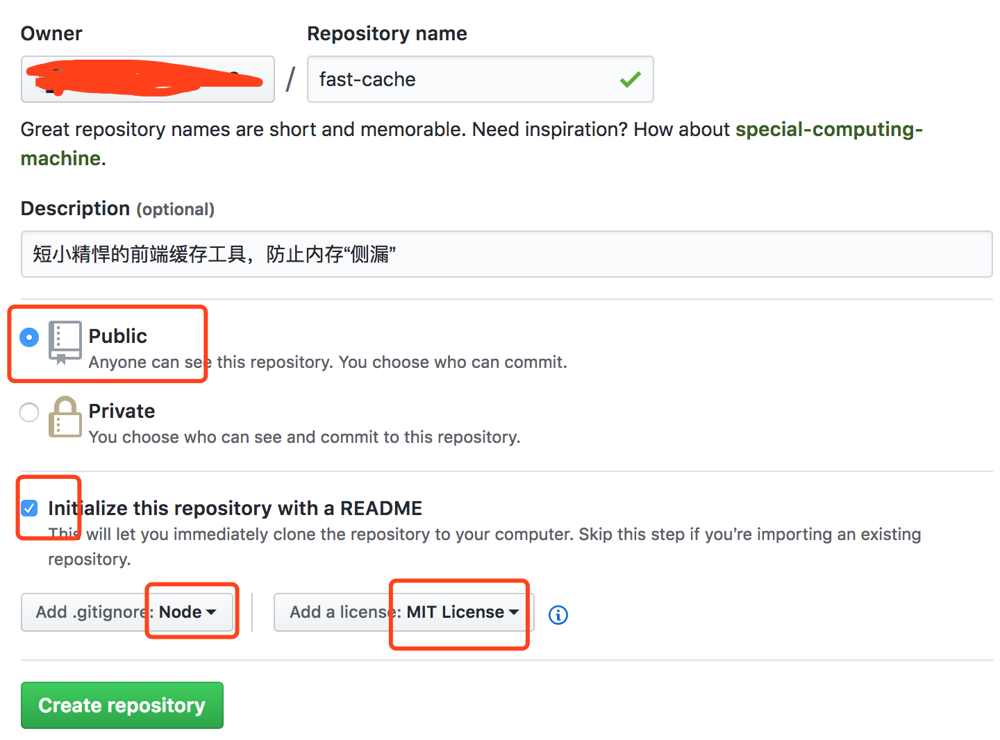
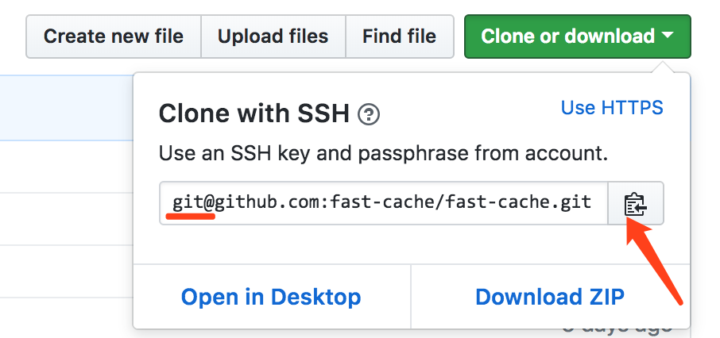
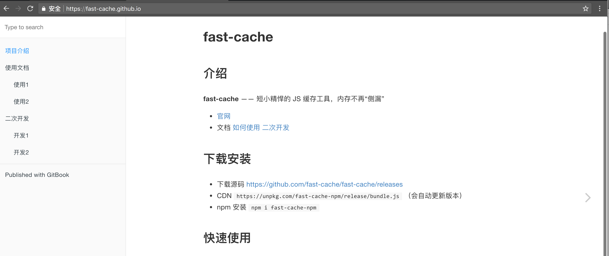

# 前言

每个程序员都应该有自己的 github 账号，并贡献自己的代码

本文将像您介绍，如何从零做一个前端的开源项目。如果您对 github 和开源不熟悉，又想开始自己的开源项目，可以通过阅读本文来入门。

# 目录

由于本文内容较多，先列一下目录供参考。

* 什么是开源？
* 为何做开源？
* 做什么？
* 注册账号
* 搭建开发环境
* 提交代码
* 创建官网
* 如何宣传？
* 持续迭代
* 总结

# 什么是开源？

您可能有很多次打开 github 去查阅下载一些项目的源码，但是您有没有总结过，开源项目到底是什么？

### 我与开源

我是开源编辑器 [wangEditor](https://github.com/wangfupeng1988/wangEditor) 的作者（欢迎去 star），这个项目已经做了有近 4 年了，目前积累了 4.5k star（现在是 2018.5）。4 年时间，我一直未间断维护升级，其中还经历了 2 次大型的重构，积累了一些经验和教训。接下来我将根据自己的经历，来为大家分析开源。

### 开源项目包含什么

开源软件并不是只是一堆源代码，如果你仔细分析或者有亲身体会的话，包含内容还是比较多的。我总结了以下内容：

* 源码
* 文档，如二次开发文档和用户使用文档
* 开发环境，告诉二次开发者如何搭建和运行代码
* 允许他人贡献代码，而不是仅仅给别人阅读源码的权限
* 问题，用户提问，维护者答复，问题共享（而不是私聊）
* 问题列表和升级计划，记录当前问题，以及何时解决、何时升级

### 其他配套设施

要做成一个成熟靠谱的开源软件产品，除了以上源码相关的方面，还需要以下配套的设施，才能完备。

* 官网，如 [wangEditor 官网](http://www.wangeditor.com/)
* 文档，可以和官网整合在一起
* 问答社区，wangEditor 的问题社区就用了 github issue
* 及时交流社区，即 QQ 群、微信群

# 为何做开源？

做开源不挣钱，这是确定的，但是为何要做开源，而且那么多人坚持做开源呢 —— 他们不是完全为了兴趣爱好，完全下班没事儿干。人只要付出劳动、付出努力，都是奔着目的性去的，有兴趣的原因，但是能让自己持之以恒做下去的，肯定不是兴趣。

其实这个问题很简单，就像看书不挣钱（买书还花钱呢），但是为何要看书呢？因为大家都知道看书能提高自己的知识面和能力。而做开源也有相似的想过，只不过很多人没接触过不知道而已。我总结了如下几个理由：

* 全面提高编程能力。 你需要从 0 打造，每部分代码都需要自己负责，不像在公司中的一颗螺丝钉。
* 提高自己的社区知名度。 github 上的 star 能间接的反应你的身价，它能让你得到业内认可。业内同行认可了，做啥事儿都好做，如内推工作。
* 锻炼自己的产品意识。 因为做开源做的是产品，不再是单纯的技术活，UI、运维、推广、收集反馈、甚至成本预算，你都得考虑。
* 技术范儿、极客精神。 作为一名程序猿，能业余打造一款开源产品是一件很帅的事情，满足自己的虚荣心。
有了充分的理由，那就开干！

# 做什么？

### 迈出第一步

这是做开源要想到的第一件事情，很多想做开源的同学，到这一步就想不下去了。还有同学，一上来就定位太高，做着做着发现根本做不出来，就提前放弃。做什么，看似简单的问题，但是很重要的一步。

### 不做什么

一些早期就知名的开源作品，很多都是因为作者在工作中遇到一个需求，而这个需求目前还没有开源产品去满足，因此自己做一个。但是对于我们大众基层程序猿，天天写业务代码，重复劳动，你遇到这种需求的概率不是特别大。因此，这个方面就不在继续往下讨论了。

想要知道做什么，你就得先明白你做开源的一些期望，然后再去想做什么。我总结了两点：

* 要快速做出第一版，至少能用。后面再慢慢迭代升级。
* 要能方便的推广使用，最好是 0 成本使用。

即做出来，推出去，要快。即，你做的快，别人用的也快。按照这种期望往下想，首先你能排除不做什么：

* 大型的框架，如做一个 UI 框架。 短期做不完，使用成本高
* 模拟成熟轮子，如在造一个 jQuery 。 有成熟方案，用户不会换
* 小众的东西。 基本没人用
* 没有特色，100% 的模仿。 用户没有更换的理由

### 做什么

排除以上这些，还剩下的范围就不做了，我推荐做开源产品的方向：

* 小而精的工具。 开发快，使用成本低。
* 要有特色，哪怕是一个。 要和别人不一样，差异化竞争。
* 一定要大众，50% 以上的开发人员都会用到
* 避开已经被成熟产品垄断的领域。 你就不要去跟 jQuery vue React 竞争了。

例如，前几天 [is-odd](https://www.npmjs.com/package/is-odd) 在知乎闹的沸沸扬扬，这个库就是判断奇数偶数，只不过考虑了各种数据类型的转换。但是你看它的 weekly downloads 数量多大。

下面列举几个我认为比较合适做开源的例子：

* cache 工具（缓存工具，整合 localStorage，以及合理的内存销毁机制）
* query2json，解析 url 参数为 json 格式
* 移动端打印 console.log ，方便移动端输出内容

其他符合上述条件的，根据自己当前的情况，大家可以自由发挥。最后，选择哪个不重要，重要的是你选择出来了。因此，如果你实在没有合适的选择，不如就从我举例中选择一个，抓阄也行。选择出来，你就可以继续往下做了，否则你一直都在纠结。

### 本文将做什么

好了，本教程就确定要做一个 cache 工具，取一个性的名字，不和现有的重复（是否重复，去 github 一搜便知），叫做fast-cache。

# 注册账号

注意，你如果现在已经有了 github 账号，也不好忽略这一章的内容，很重要！

你一旦注册一个 github 账号并且去做开源产品，那你就要作为一个个人品牌持续运营下去，不能随便改名字。因此注册账号时一定要慎重考虑，不能随便弄一个，做一段时间又想改。

### 组织还是项目

首先，你要明确你即将注册的账号是专门针对一个产品（即项目账号）还是将运维多个产品（即组织账号）？

例如，[facebook](https://github.com/facebook) 就是 github 中的组织账号，其下有很多开源产品，如 react 和 hhvm 等。而 [rollup](https://github.com/rollup) 就是 github 中的项目账号，其下就一个项目 rollup ，其他的项目都是一些附件插件。

对于我们个人开发者，我推荐注册项目账号，即以你项目的名称取个账号的名字。这样还有一个好处，就是后面讲到官网的时候，你可以用更短、更好记的官网地址。例如，如果不自己申请域名、假设服务器（即不花一分钱）的情况下，以上例子中他们的官网有区别。

* rollup 的官网地址将是 rollup.github.io ，很短；
* react 的官网地址只能是 facebook.github.io/react，多了一级目录；（注意是不申请域名、不花钱的情况下）

>最后，我选择项目账号，因此我需要注册的账号是 fast-cache 。

### 注册账号

我们分别要去 github 和 npm 注册以 fast-cache 为用户名的账号，注册过程就不写了，都是傻瓜式操作。需要注意的是，如果被墙，自己想法办科学上网。

### 创建项目

登录 github ，点击右上角的“+”可看到新建项目的链接，或者直接访问 https://github.com/new 。创建项目如下图所示，注意图中红框部分。



创建完成之后，通过 https://github.com/fast-cache/fast-cache 即可访问到项目的主页，这是你就已经有了自己的开源项目了。

### 添加 ssh key

ssh key 就是连接你的电脑和 github 服务器的一把钥匙，只有添加成功了才能把你本地的代码提交到 github 服务器。

如果你是 mac os 系统，运行 ssh-keygen 即可一步一步生成 ssh key ，然后运行 `pbcopy < ~/.ssh/id_rsa.pub` 即可拷贝下来，等着粘贴。windows 系统用户，自己百度搜索 github ssh key 即可找到相关介绍文章，跟着做就行了。

在 github 个人中心的设置界面，能找到 SSH and GPS keys 菜单栏，或者直接访问 https://github.com/settings/keys 。页面中点击右侧“new ssh key”按钮即可添加 ssh key ，把刚才的内容粘贴过来添加上就行了。

### 下载代码

进入 github 项目主页，复制 git 地址（注意选择 use ssh ，不要 use https ），如下图



复制下来的内容应该是 git@github.com:fast-cache/fast-cache.git ，然后你选择一个合适的文件夹或目录，执行下载命令。

```
git clone git@github.com:fast-cache/fast-cache.git
```

下载完毕，进入代码目录，运行如下命令修改当前 git 的用户名和邮箱，改成和当前 github 用户名和注册邮箱一致。

```
cd fast-cache
git config user.name 'fast-cache'
git config user.email 'fast-cache@github.com'
```

最后，随便修改一下 README.md 文件的内容，然后提交，看能否成功？成功了就说明刚才的ssh key 生效了。

```
git add .
git commit -m "first update"
git push origin master
```

# 搭建开发环境

### 初始化

进入项目目录，然后命令行运行 `npm init` ，按照提示进行初始化即可。提示中的信息，能写的都写上，别随意忽略了。初始化完成之后，项目根目录下会有 package.json 的文件。

### 规范版本号

打开 package.json 文件，将版本号定义为 "version": "0.0.1" 。以后我们每次正式提交代码，版本号都不一样。版本号分三级，分别为：

* 一级，重构版本
* 二级，重大功能改进
* 三级，小升级或者 bug 修复

为何从 0.0.1 开始？因为 0.x.x 可以认为是非正式版本、测试版，而从 1.x.x 开始，就是正式发布的版本了。

### 规范一级目录

项目的一级目录要提前规范好，最起码一些常用的目录要提前订好留用，不能乱来。例如：

* src - 源代码
* release - 发布结果
* test - 单元测试用例
* doc - 文档
* example - 示例

### 构建工具

这部分比较独立，内容也比较多，就不详细讲了，用最常用的 webpack 做一个简单演示吧。

安装插件 `npm i babel-core babel-loader babel-polyfill babel-preset-es2015 babel-preset-latest webpack webpack-cli --save-dev` 。

项目根目录下创建 .babelrc 文件，内容如

```javascript
{
    "presets": ["es2015", "latest"],
    "plugins": []
}
```

项目根目录下创建 webpack.config.js 文件，内容如

```javascript
module.exports = {
    entry: './src/index.js',
    output: {
        path: __dirname,
        filename: './release/bundle.js'
    },
    module: {
        rules: [{
            test: /\.js?$/,
            exclude: /(node_modules)/,
            loader: 'babel-loader'
        }]
    }
}
```

最后，修改 package.json 中的 scripts ，增加 `"release": "webpack"`。然后命令行运行` npm run release` ，就可生成 release 的内容。

### 运行示例

release 的内容已经发布出来了，还要运行起来，最简单的方式，在example创建test.html，然后引用 release 的内容。

```html
<!DOCTYPE html>
<html>
<head>
    <meta charset="UTF-8">
    <title>example</title>
</head>
<body>
    <p>example</p>
    <script src="../release/bundle.js"></script>
</body>
</html>
```

为何规范化运行，可以修改 package.json 中的 scripts ，增加 "example": "http-server -p 8880" 。然后命令行运行 npm run example ，浏览器访问 http://localhost:8880/example/test.html 。

### 规范 git 分支

至少要存在两个分支，master 和 dev ， dev 是开发中的代码。当然，你可以规范更多的分支，例如 `next fix-bug` 等，但是注意一个原则 —— 用不到的就先不要规划。

### 完善 README.md

README.md 是开源项目的一张脸，用户的第一印象。必须包含以下内容：

* 产品简介（此处要突出特点，打差异化竞争）
* 产品安装和下载
* 快速使用（详细的使用文档或者二次开发文档，外链即可）
* 交流提问区
* 关于作者（放你的博客链接，和收款二维码）

最后，把以上完成的工作，都提交到 github 中。

# 提交代码

### 写代码

具体写什么代码不是本文的重点，你尽情的根据自己的项目来写自己的代码就是了。记得一定要使用编码规范的工具，例如 es-lint 等，否则经过长时间的维护，必然留坑。

### 写文档 & 写测试用例

注意，文档和测试用例对于一个开源产品来说非常重要！非常重要！非常重要！而且，文档和测试用例本身就是代码不可分割的一部分。

如何写测试用例，需要用到其他工具，内容也相对独立，这里就不介绍了，自己去查一查吧。再次强调，测试用例很重要！！！

在写文档之前，还需要准备其他的工具。定位到项目目录下，npm i gitbook-cli -g 安装 gitbook ，然后创建 SUMMARY.md ，内容如下：

```
# Summary

* [项目介绍](README.md)
* [使用文档](doc/use/README.md)
    * [使用1](doc/use/use1.md)
    * [使用2](doc/use/use2.md)
* [二次开发](doc/dev/README.md)
    * [开发1](doc/dev/dev1.md)
    * [开发2](doc/dev/dev2.md)
```

其实一看这个文件内容就知道，这是一个文档的目录，你可以根据自己项目的需要重新定义这个目录。需要注意的是，第一行 `* [项目介绍](README.md)` 对应的是已经存在的 README.md 文件。

运行 `gitbook init` ，会看到各个文件都被创建了，就可以完善各个文档的内容。内容完成之后，运行 `gitbook build` 可以将 md 文件发布为 html 文件，默认放在 `_book` 文件夹。启动了 `npm run example` 之后，可以访问 http://127.0.0.1:8880/_book/ 查看效果。

最后，再次修改一下 README.md ，把文档的链接加上

>[如何使用](./doc/use/README.md) [二次开发](./doc/dev/README.md)

### 提交第一版代码

首先，修改一下 .gitignore 文件，加上一行 `_book` ，把打包出来的文件忽略掉。然后用之前的方式提交到 github 的 master 分支，这里不再赘述了。

接下来，创建 tag 并提交，代码如下：

```
git tag -a 'v0.0.1' -m 'first commit'
git push origin v0.0.1
```

提交之后，下载地址就有了 ， https://github.com/fast-cache/fast-cache/releases 这里可以下载到各个版本的源码。

最后要提交到 npm 上，能让使用者通过 npm 进行安装。首先，运行 `npm add user` 和 `npm login` 来登录，根据提示将你之前注册 npm 时的账号、密码、邮箱写上就行了，问题不大。然后，在项目的根目录运行 `npm publish` . ，此时问题来了！！！

运行之后报了 403 错误，刚才明明登录成功了，不可能有权限问题呀。后来一查才知道，原来 fast-cache 在 npm 中和其他项目重名了！！！没办法，只能改名，将 package.json 中的名称改为 fast-cache-npm ，然后再发布就成功了。

>发布之后，通过 https://www.npmjs.com/package/fast-cache-npm 就可以访问 npm 项目主页了。

>注意，为项目取名时，一定要提前把名字在 github 和 npm 搜索一下，确认没有重名才行！！！

### 升级代码并提交

上述是第一次提交代码的流程，下面简述一下升级代码之后的提交流程。在代码开发阶段的步骤总结如下：

* 来一个 dev 分支，不要在 master 分支开发
* 修改 package.json 版本号，按照之前既定的版本规则修改，不能乱改
* 修改代码、文档和测试用例
* 自测
* 将 dev 分支提交到远程

代码开发完成之后，提交的流程如下：

* 再次确认版本号，因为版本号非常重要
* 将 dev 合并到 master ，并提交 master 到远程
* 创建 tag 并提交到远程
* 提交到 npm

### 合并 pr

pr 即 Pull Request 的简称。

开源软件最大的特色就是允许全世界的开发者都能为其贡献代码，你这个开源项目也不例外。其他人很有可能会通过 github 的 pr 为你的项目贡献自己的代码，到时候你既得欣然接受，又不能茫然接受。

其他人贡献的 pr 可以通过 https://github.com/fast-cache/fast-cache/pulls 链接看到。对于每一个 pr ，如果你想合并，直接 merge 就好了（合并完之后，本地代码要随时更新一下）；如果你不想合并，留言说明然后关闭掉即可。

# 创建官网

我们通过 github pages 的机制即可免费创建项目的挂网，不用花一分钱。

### 创建项目

登录 github ，创建一个名为 fast-cache.github.io 的项目，名字必须是这一个！！！然后下载到本地，即 git clone xxxx 。然后，进入项目目录，新建一个 index.html ，然后随便写点什么，例如 `<h1>hello world</h1>` ，提交到 github 远程。

最后，访问 fast-cache.github.io ，你就能看到刚才的内容了，最简单的官网就这么出来了。做到这里，你应该知道 github pages 就是一个静态页面的服务器，上传相应的 html 就能显示。

### 生成官网

此前用 gitbook 将文档生成为 html 了，应该还记得。那么我们现在重新运行 gitbook build 生成 html ，然后将所有的 html 拷贝到这里来，全部提交上去，正式的官网也就出来了。



### 更新 README.md

记得要修改 README.md ，把官网的地址加进去。

### 如何宣传

“酒香不怕巷子深”这句话在当代并不适用，特别是互联网中。我在 N 年前看过一本创业公司老板写的研发项目管理方面的书，到现在就记住一句话 —— “一个公司的核心竞争力，一是技术，二是营销”。因此，虽然是一个简单的开源项目，宣传也是必须必要的。

宣传和更新维护都是一个漫长的过程，作为屌丝账户的我们（不是 google facebook 等明星账户），能做的只能是坚持。

### 写博客

首先，要围绕着你做的产品功能来写博客。例如针对 fast-cache ，我们可以写类似这样的博客。分体分两类，第一类是相关的技术干货文章，第二类是产品介绍，应该以第一类为主。

* 总结如何做前端缓存
* 前端缓存的坑
* 预防前端内存泄露
* 前端缓存插件 fast-cache使用总结
* fast-cache 开发半年记
* ……

其次，要正确选择发表的网站，我的建议是这样的：

* 选择一个地方作为你博客的唯一主页，例如 github ，像创建官网一样创建个人博客网站。
* 博客贴到各大博客网站，如掘金、知乎专栏、博客园。选择三个流量较大的即可，不用到处乱贴。
* 博客内容要写明白原文的链接，并写明产权。
* 最好能找到一些媒体（如 InfoQ）或者大牛公众号帮你转发。

### 回答相关问题

去知乎、sf.gg 甚至是 stackoverflow 上面去搜索、关注与你产品相关的问题，积极参与回答。回答问题也有技巧：

* 字数只能多不能少。最好图文并茂，还能讲个笑话
* 回答要专业，经过亲自测试，不要想当然的瞎猜
* 回答问题的最后，顺便推广自己的产品

### 口碑宣传

所谓口碑宣传就是让用户资源的帮助宣传，那就需要把产品做好，那如何做“好”呢？

* 明确产品定位，有特色。做“T”型产品，差异化竞争。把一方面做好就行了，所有都做好不可能。
* 及时回复问题，定期更新升级，做好升级计划，让用户看到产品在不管进步和变化。

# 持续迭代

主要来探讨一下如何有效率的持续迭代，再不影响工作、生活的情况下。

### 统一问题收集区

这一点非常重要！！！ 因为：

* 你没有那么多精力去很多个平台回复问题
* 你没有那么多时间天天盯着 QQ 群解答问题
* 问题应该被集中起来，供使用者反复查阅

例如 wangEditor 的问题收集区主要集中在 github issue 列表，其他的地方的提问直接忽略。还有一点要特别注意，问题应该本分享，而不是私聊，因此如下提问方式直接忽略：

* QQ 群提问和 QQ 私聊提问（或微信）
* 私信提问
* 邮件提问

回顾我前几年刚做开源的经历，一开始你和使用者都会非常不习惯这种方式，特别是那些讨厌的伸手党。刚开始进来的用户直接 QQ 私聊或者群里 @ 你，让你做他们的技术客服，随叫随到，这种人你一定要坚持不理会，然后引导他们去 github 提交 issue 。慢慢的，你的社区和 QQ 群人多了，大家都知道这个套路，再有新人进来会自动被引导到 github 中提交 issue 。

### 定期答复和升级

让别人自愿、积极的去提交 issue 的前提是你能及时的答复。根据我的经验，给你以下建议：

* 定期回复 每天（下班或者上班之前）看看 github issues 然后先答复，临时无法搞清楚的就回复“周末时看下再答复”。这样每天大约花费 5-15 分钟即可，出去抽根烟的功夫。最后，需要修改的问题，先记录下。
* 定期升级 每周拿出 2 个小时（随便一个晚上或者周末时间）把记录下的问题，按照优先级高低顺序修复。就 2 小时，改多少算多少，改不完下周再说。改完的问题要及时回复 issue 并 close 。每周 2 小时，对你这周的工作生活应该不会受到影响。

### 学会拒绝

当用户慢慢增多，用户会提出各种看似奇葩的需求，以满足他们自己的使用需要。此时就需要你来分辨该需求是否应该被添加。我总结了以下判断标准：

* 很多用户都提过这个需求，即大众需求
* 你自己判断这个需求对大部分用户都有用
* 该需求符合产品定位以及产品发展的方向
* 该需求能抹平和竞品的差距，或者能和竞品差异化竞争
* 符合以上要求的，可以加入升级计划。不符合要求的，你一定要无情拒绝，此时不要做好人。

# 持之以恒

虽然每天十几分钟、每周两小时看似不占用太多时间，但是你要持之以恒的坚持一年、两年、三年，你能做到吗？

你做任何什么事情，没点持之以恒的态度，都做不成功。

# 总结

回顾一下本课程的重点内容：

* 做开源的意义。不是套话，你意识不到，肯定就做不下去；
* 开源项目是什么。不仅仅是源码。
* 做什么。小而精，不要大而全。
* 怎么做？
* 宣传和持续迭代

>作者：

>链接：http://www.imooc.com/article/28240

>来源：慕课网

>本文原创发布于慕课网 ，转载请注明出处，谢谢合作